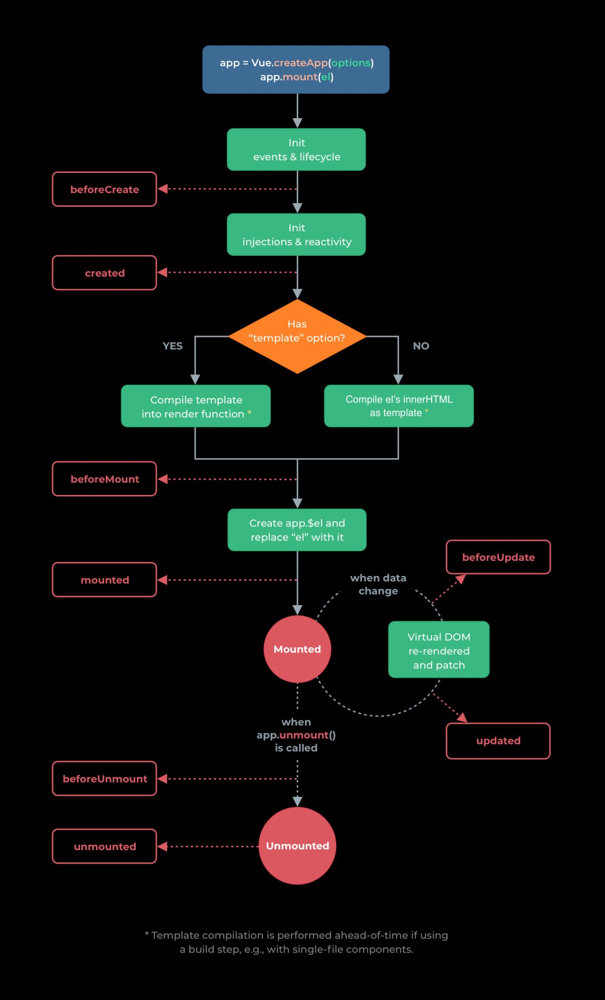

# Vue Interview Questions & Answers

Полезные ссылки
* [Vue[ru]](https://ru.vuejs.org/v2/guide/render-function.html)
* [Vue Router[ru]](https://router.vuejs.org/ru/)
* [Vuex[ru]](https://vuex.vuejs.org/ru/)
  * [Vuex example code](https://github.com/vuejs/vuex/tree/dev/examples/shopping-cart)
* [Testing[ru]](https://ru.vuejs.org/v2/guide/testing.html)

### Оглавление <a name="table-of-contents"></a>
| №. | Вопросы |
|---- | ---------
|   | VUE |
|1  | [Что такое VueJS](#what-is-vuejs) |
|2  | [В чем преимущества VueJS перед ReactJS, ваше мнение?](#what-are-the-advantages-of-vuejs-over-reactjs)|
|3  | [Жизненный цикл в VueJS](#lifecycle-methods-of-vuejs)|
|   | [Creation (Initialization)](#creation)|
|   | [Mounting (DOM Insertion)](#mounting)|
|   | [Updating (Diff & Re-render)](#updating)|
|   | [Destruction (Teardown)](#destruction)|
|4  | [Что такое условные директивы?](#what-are-the-conditional-directives)|
|5  | [Чем отличаются v-show и v-if](#what-is-the-difference-between-v-show-and-v-if-directives)|
|6  | [Какова цель директивы v-for?](#what-is-the-purpose-of-v-for-directive)|
|7  | [Почему не следует использовать директивы if и for вместе в одном элементе?](#why-should-not-use-if-and-for-directives-together-on-the-same-element)|
|8  | [Что такое props?](#what-are-props)|
|9  | [Расскажите о доступных валидациях для props](#describe-about-validations-available-for-props)|
|10 | [Что такое `render-функции` или какие способы отрендорить компонент вы знаете?](#render-function)|
|11 | [Что такое slots?](#what-are-slots)|
|12 | [slots vs children](#slots-vs-children)|
|   | Navigation |
|13 | [Routing concept](#routing-concept)|
|14 | [Режим HTML5 History](#history)|
|15 | [Поведение прокрутки страницы](#page-scroll)|
|16 | [Плавная прокрутка](#lazy-scroll)|
|   | Vuex  |
|17 | [Что такое Vuex](#vuex)|
|18 | [Modules](#modules)|
|19 | [State](#state)|
|20 | [Getters](#getters)|
|21 | [Actions](#vuex)|
|22 | [Mutations](#vuex)|
|   | Валидация форм  |
|23 | [Валидация форм](#form-validation)|
|   | Тестирование  |
|24 | [Общее](#testing)|

1.  ### Что такое VueJS <a name="what-is-vuejs"></a>
    **Vue.js** - это прогрессивный Javascript фреймворк с открытым исходным кодом для создания пользовательских интерфейсов.
    Основная библиотека VueJS ориентирована только на `view layer`(слой просмотра), и ее легко подобрать и интегрировать с другими 
    библиотеками или существующими проектами.

    **[⬆ Back to Top](#table-of-contents)**
2.  ### В чем преимущества VueJS перед ReactJS, ваше мнение?
    <a name="what-are-the-advantages-of-vuejs-over-reactjs"></a>

     Vue имеет следующие преимущества перед React:
     1. Vue меньше и быстрее
     2. Удобные шаблоны облегчают процесс разработки.
     3. Он имеет более простой синтаксис JavaScript без изучения JSX.

     **[⬆ Back to Top](#table-of-contents)**

3. Жизненный цикл в VueJS <a name="lifecycle-methods-of-vuejs"></a>

    > Все хуки жизненного цикла автоматически привязывают контекст this к экземпляру, чтобы вы могли получить доступ к данным, вычисляемым свойствам и методам.

  

  * <a name="creation"></a> `Creation(Initialization):` Хуки создания позволяют выполнять действия еще до того, как ваш компонент будет добавлен в DOM. Вам нужно использовать эти хуки, если вам нужно настроить что-то в своем компоненте как во время клиентского, так и серверного рендеринга. В отличие от других хуков, хуки создания также запускаются во время рендеринга на стороне сервера.
      * `beforeCreate`: Этот хук запускается при самой инициализации вашего компонента. Hook наблюдает за данными и событиями инициализации в вашем компоненте. Здесь данные по-прежнему не являются реактивными, а события, происходящие в течение жизненного цикла компонента, еще не настроены.

        **Аннотаации:**
        - Вызывается синхронно сразу после инициализации экземпляра

      * `created`: Этот хук вызывается, когда Vue настроил события и наблюдение за данными. Здесь события активны, и доступ к реактивным данным разрешен, хотя шаблоны еще не смонтированы или визуализированы.

        **Аннотаации:**
        - Вызывается синхронно **после создания экземпляра**. 
        - На этом этапе обрабатываются и сетапятся данные экземпляра, это означает что можем пользоваться: **data, computed, watchers, methods**
        - к DOM доступа еще не имеем

      > Помните, что у вас не будет доступа к DOM или целевому элементу монтирования (this. $ El) внутри хуков создания.

  * <a name="mounting"></a> `Mounting(DOM Insertion):` являются наиболее часто используемыми хуками и они позволяют вам получить доступ к вашему компоненту непосредственно до и после первого рендеринга.
      * `beforeMount`: позволяет вам получить доступ к вашему компоненту непосредственно до рендеринга.

        **Аннотаации:**
          - Вызывается непосредственно **перед началом маунта**: функция рендеринга будет вызвана в первый раз.  
          - Этот хук **не вызывается** во время рендеринга на стороне сервера.

      * `mounted`: Это наиболее часто используемый хук, и у вас будет полный доступ к реактивному компоненту, шаблонам и визуализированной модели DOM (через. This. $ El). Наиболее часто используемые шаблоны - это выборка данных для вашего компонента.

        **Аннотаации:**
          - Вызывается **после маунта** экземпляра, где элемент, переданный в `app.mount`, заменяется вновь созданным `$el`.
          - Не гарантирует что дочерние компоненты также замаунтились, если хотим подождать, пока все будет отрисовано, используем `$nextTick` внутри метода `mount`  
          - Подходит для работы с DOM (рефы например)   
          - Этот хук **не вызывается** во время рендеринга на стороне сервера.  

  * <a name="updating"></a> `Updating (Diff & Re-render)`: Эти хуки вызываются всякий раз, когда изменяется реактивное свойство, используемое вашим компонентом,
    или что-то еще вызывает его ререндеринг.
      * `beforeUpdate`: запускается после изменения данных в вашем компоненте и начинается цикл обновления, прямо перед тем, как DOM будет исправлен и повторно отрисован.

        **Аннотаации:**
          - Вызывается при изменении данных **до исправления DOM**.  
          - Это хорошее место для доступа к существующей модели DOM **перед обновлением**  
          - Этот хук **не вызывается** во время рендеринга на стороне сервера.  

      * `updated`: Этот хук запускается после изменения данных в вашем компоненте и повторного рендеринга DOM.

        **Аннотаации:**
          - Вызывается после изменения данных и изменения DOM  
          - Можем выполнять операции, зависящие от DOM.  
          - Этот хук **не вызывается** во время рендеринга на стороне сервера.   
          - Не гарантирует что дочерние компоненты также замаунтились, сли хотим подождать, пока все будет отрисовано, используем $nextTick внутри метода `updated`  

  * <a name="destruction"></a> `Destruction (Teardown)`: позволяют выполнять действия при уничтожении вашего компонента, такие как очистка или отправка аналитики.
      * `beforeDestroy`: отрабатывает прямо перед удалением. Если вам нужно очистить события или реактивные подписки, вероятно, самое время это сделать в `beforeDestroy. Ваш компонент по-прежнему будет полностью функциональным.

        **Аннотаации:**
          - Вызывается непосредственно **перед размонтированием** экземпляра компонента. На этом этапе **экземпляр все еще полностью работоспособен**.  
          - Этот хук **не вызывается** во время рендеринга на стороне сервера.  
          - Отписываемся от подписок и все такое    

      * `destroyed`: вызываются после того, как ваш компонент был уничтожен, его директивы были освобождены, а его прослушиватели событий были удалены.

        **Аннотаации:**
          - Вызывается после размонтирования экземпляра компонента
          - Все директивы экземпляра компонента были отключены
          - Все прослушиватели событий были удалены
          - Все экземпляры дочерних компонентов также были размонтированы

      **[⬆ Back to Top](#table-of-contents)**

4. ### Что такое условные директивы? <a name="what-are-the-conditional-directives"></a>
    VueJS предоставляет набор директив для отображения или скрытия элементов в зависимости от условий. Доступные директивы: **v-if, v-else, v-else-if и v-show**.
    
    **1. v-if:** Директива v-if добавляет или удаляет элементы DOM на основе заданного выражения. Например, кнопка ниже не будет отображаться, если для isLoggedIn установлено значение `false`.
    
    **2. v-else:** Эта директива используется для отображения содержимого только тогда, когда выражение рядом с `v-if` принимает значение `false`. Это похоже на блок else в любом языке программирования для отображения альтернативного содержимого, и ему предшествует блок `v-if` или `v-else-if`. Вам не нужно передавать этому значение.
    
    **3. v-else-if:** Эта директива используется, когда нам нужно проверить более двух опций.
    Например, мы хотим отображать некоторый текст вместо кнопки входа в систему, когда для свойства `ifLoginDisabled` установлено значение `true`. Этого можно добиться с помощью оператора `v-else`.

    **4. v-show:** Эта директива похожа на `v-if`, но отображает все элементы в DOM, а затем использует свойство отображения CSS для отображения / скрытия элементов. Эта директива рекомендуется, если элементы часто включаются и выключаются.
   
    **[⬆ Back to Top](#table-of-contents)**

5.  ### Чем отличаются v-show и v-if?<a   name="what-is-the-difference-between-v-show-and-v-if-directives"></a>
    Some of the main differences between between **v-show** and **v-if** directives:

    1. `v-if` отображает элемент в DOM только в том случае, если выражение проходит, тогда как `v-show` отображает все элементы в DOM, а затем использует свойство отображения CSS для отображения / скрытия элементов на основе выражения.
    2. `v-if` поддерживает директивы `v-else` и `v-else-if`, тогда как v-show не поддерживает директивы `else`.
    3. `v-if` имеет более высокую стоимость переключения, в то время как v-show имеет более высокую начальную стоимость рендеринга. то есть v-show имеет преимущество в производительности, если элементы часто включаются и выключаются, тогда как v-if имеет преимущество, когда дело доходит до начального времени рендеринга.
    4. `v-if` поддерживает вкладку `<template>`, a `v-show` нет.

    **[⬆ Back to Top](#table-of-contents)**
6.  ### Какова цель директивы `v-for` <a name="what-is-the-purpose-of-v-for-directive"></a>
    Встроенная директива v-for позволяет нам перебирать элементы в массиве или объекте. Вы можете выполнять итерацию по каждому элементу массива или объекта.
    1. **Array usage:**
    ```javascript
    <ul id="list">
      <li v-for="(item, index) in items">
        {{ index }} - {{ item.message }}
      </li>
    </ul>

    var vm = new Vue({
      el: '#list',
      data: {
        items: [
          { message: 'John' },
          { message: 'Locke' }
        ]
      }
    })
    ```
    Вы также можете использовать `of` в качестве разделителя вместо` in`, подобно итераторам javascript.

    2. **Object usage:**
    ```javascript
    <div id="object">
      <div v-for="(value, key, index) of user">
        {{ index }}. {{ key }}: {{ value }}
      </div>
    </div>

    var vm = new Vue({
      el: '#object',
      data: {
        user: {
          firstName: 'John',
          lastName: 'Locke',
          age: 30
        }
      }
    })
    ```

    **[⬆ Back to Top](#table-of-contents)**
7. ### Почему не следует использовать директивы if и for вместе в одном элементе? <a name="why-should-not-use-if-and-for-directives-together-on-the-same-element"></a>
    Не рекомендуется использовать v-if для того же элемента, что и v-for. Поскольку директива v-for имеет более высокий приоритет, чем v-if.

    Есть два случая, когда разработчики пытаются использовать эту комбинацию:

     1. Чтобы отфильтровать элементы в списке

       Например, если вы попытаетесь отфильтровать список с помощью тега v-if,

       ```javascript
         <ul>
           <li
             v-for="user in users"
             v-if="user.isActive"
             :key="user.id"
           >
             {{ user.name }}
           <li>
         </ul>
       ```
       Этого можно избежать, подготовив отфильтрованный список с использованием вычисляемого свойства в исходном списке.
       ```javascript
         computed: {
           activeUsers: function () {
             return this.users.filter(function (user) {
               return user.isActive
             })
           }
         }
         ...... //
         ...... //
         <ul>
           <li
             v-for="user in activeUsers"
             :key="user.id">
             {{ user.name }}
           <li>
         </ul>
       ```
     2. Чтобы не отображать список, если он должен быть скрыт

       Например, если вы попытаетесь условно проверить, должен ли отображаться пользователь или скрыт

       ```javascript
         <ul>
           <li
             v-for="user in users"
             v-if="shouldShowUsers"
             :key="user.id"
           >
             {{ user.name }}
           <li>
         </ul>
       ```
       Это можно решить, переместив условие в родительский объект, избегая этой проверки для каждого пользователя.
       ```javascript
         <ul v-if="shouldShowUsers">
           <li
             v-for="user in users"
             :key="user.id"
           >
             {{ user.name }}
           <li>
         </ul>
       ```
     **[⬆ Back to Top](#table-of-contents)**
8.  ### Что такое `props`?
    <a name="what-are-props"></a>

     Props - это настраиваемые атрибуты, которые вы можете зарегистрировать в компоненте. Когда значение передается в атрибут prop, оно становится свойством этого экземпляра компонента. Вы можете передать этот список значений как опцию props и использовать их как переменные данных в шаблоне.
     ```javascript
     Vue.component('todo-item', {
       props: ['title'],
       template: '<h2>{{ title }}</h2>'
     })
     ```
     ```vue
     <todo-item title="Learn Vue conceptsnfirst"></todo-item>
     ```

     **[⬆ Back to Top](#table-of-contents)**
9.  ### Расскажите о доступных валидациях для `props`
     <a name="describe-about-validations-available-for-props"></a>

     Vue предоставляет такие проверки, как типы, обязательные поля, значения по умолчанию, а также настраиваемые проверки. Вы можете предоставить объекту требования к проверке значения props, как показано ниже:

     Давайте возьмем пример компонента Vue профиля пользователя с возможными проверками,
     ```javascript
     Vue.component('user-profile', {
       props: {
         // Basic type check (`null` matches any type)
         age: Number,
         // Multiple possible types
         identityNumber: [String, Number],
         // Required string
         email: {
           type: String,
           required: true
         },
         // Number with a default value
         minBalance: {
           type: Number,
           default: 10000
         },
         // Object with a default value
         message: {
           type: Object,
           // Object or array defaults must be returned from
           // a factory function
           default: function () {
             return { message: 'Welcome to Vue' }
           }
         },
         // Custom validator function
         location: {
           validator: function (value) {
             // The value must match one of these strings
             return ['India', 'Singapore', 'Australia'].indexOf(value) !== -1
           }
         }
       }
     })
     ```

     **[⬆ Back to Top](#table-of-contents)**

10.  ### Что такое `render-функции` или какие способы отрендорить компонент вы знаете?
      <a name="render-function"></a>
      В большинстве случаев для формирования HTML с помощью Vue рекомендуется использовать шаблоны. Впрочем, иногда возникает необходимость в использовании всех алгоритмических возможностей JavaScript. В таких случаях можно применить `render-функции` — более низкоуровневую альтернативу шаблонам.

      Простой пример использования темплейта
      ```vue
      <template>
        <div :class="{'is-rounded': isRounded}">
          <p>Welcome to Vue render functions</p>
        </div>
      </template>
      ```
      При использовании шаблонов для реализации интерфейса, который генерирует только заголовок, основанный на свойстве level, вы быстро столкнётесь со следующей ситуацией:
      ```javascript
      <script type="text/x-template" id="anchored-heading-template">
        <h1 v-if="level === 1">
          <slot></slot>
        </h1>
        <h2 v-if="level === 2">
          <slot></slot>
        </h2>
        <h3 v-if="level === 3">
          <slot></slot>
        </h3>
        <h4 v-if="level === 4">
          <slot></slot>
        </h4>
        <h5 v-if="level === 5">
          <slot></slot>
        </h5>
        <h6 v-if="level === 6">
          <slot></slot>
        </h6>
      </script>
      ```
      ```
      Vue.component('anchored-heading', {
        template: '#anchored-heading-template',
        props: {
          level: {
            type: Number,
            required: true
          }
        }
      })
      ```
      Выглядит не очень. Шаблон получился не только очень большим — приходится ещё и `<slot></slot>` повторять для каждого возможного уровня заголовка.

      Шаблоны хорошо подходят для большинства компонентов, но рассматриваемый сейчас — явно не один из них. Давайте попробуем переписать компонент, используя `render`-функцию:

      ```
      Vue.component('anchored-heading', {
        render: function (createElement) {
          return createElement(
            'h' + this.level,   // имя тега
            this.$slots.default // массив дочерних элементов
          )
        },
        props: {
          level: {
            type: Number,
            required: true
          }
        }
      })
      ```

      **Note:** The react components are built with render functions in JSX.

     **[⬆ Back to Top](#table-of-contents)**
11.  ### Что такое slots?
      <a name="what-are-slots"></a>
     
     ```javascript
     Vue.component('alert', {
       template: `
         <div class="alert-box">
           <strong>Error!</strong>
           <slot></slot>
         </div>
       `
     })
     ```
     Теперь вы можете вставить динамический контент, как показано ниже,
     ```vue
     <alert>
       There is an issue with in application.
     </alert>
     ```

     ```
     <div class="details-content-card__action">
      <slot name="cardTitle" />
     </div>
     ```

     ```
     <template #cardTitle>
      Title
     </template>
     ```

     **[⬆ Back to Top](#table-of-contents)**

12.  ### Slots vs Children
      <a name="slots-vs-children"></a>
      Вы можете задаться вопросом зачем нужны `slots()` и `children` одновременно. Разве не будет `slots().default` возвращать тот же результат, что и `children`? В некоторых случаях — да, но что если у нашего функционального компонента будут следующие дочерние элементы?

      ```
      <my-functional-component>
        <p v-slot:foo>
          первый
        </p>
        <p>второй</p>
      </my-functional-component>
      ```

      Для этого компонента, `children` даст вам оба абзаца, `slots().default` — только второй, а `slots().foo` — только первый. Таким образом, наличие и `children`, и `slots()` позволяет выбрать, знает ли компонент о системе слотов или просто делегировать это другому компоненту, путём передачи `children`.

     **[⬆ Back to Top](#table-of-contents)**

## Navigation

13. ### Routing concept
    Базовый синтаксис подключения

    ```
    import Vue from 'vue';
    import VueRouter from 'vue-router';

    Vue.use(VueRouter);

    const routes = [
      {
        path: '/v3/companies',
        name: 'Companies',
        component: () => import('../apps/pages/CompaniesList.vue'),
      },
      {
        path: '/v3/companies/:slug',
        component: () => import('../apps/pages/CompaniesDetails.vue'),
        children: [
          {
            path: 'commercial',
            name: 'commercial',
            component: () => import('../Commercial/Index.vue'),
          },
          {
            path: 'documents',
            name: 'documents',
            component: () => import('../Documents/Index.vue'),
          },
        ],
      },
      {
        path: '/v3/companies/*',
        redirect: '/404',
      },
    ];

    const router = new VueRouter({
      mode: 'history',
      routes,
    });

    export default router;
    ```

     **[⬆ Back to Top](#table-of-contents)**

14. ### Режим HTML5 History
    <a name="history"></a>
    По умолчанию `vue-router` работает в режиме `хэша` — он использует хэш URL для симуляции полного URL-адреса, что позволяет избежать перезагрузки страницы при изменении URL.

    Мы можем обойтись без хэша, используя `режим history`, который работает с API `history.pushState` для достижения той же цели:

    ```
    const router = new VueRouter({
      mode: 'history',
      routes: [...]
    })
    ```

     **[⬆ Back to Top](#table-of-contents)**

15. ### Поведение прокрутки страницы
     <a name="page-scroll"></a>

    При переходе между страницами в рамках клиентской маршрутизации, можно сохранять позицию прокрутки для каждой записи в истории (что обычно делают браузеры при работе с традиционными приложениями), или же прокручивать страницу наверх. `vue-router` позволяет использовать оба варианта, и даже более того — позволяет полностью настроить поведение прокрутки при навигации.

    > Примечание: эта возможность работает если браузер поддерживает history.pushState.

    При создании экземпляра маршрутизатора, вы можете указать функцию scrollBehavior:
    ```
    const router = new VueRouter({
      routes: [...],
      scrollBehavior(to, from, savedPosition) {
        // возвращаем требуемую позицию прокрутки
      }
    })
    ```

    Функция `scrollBehavior` получает объекты маршрутов `to` и `from`. В третьем параметре, `savedPosition`, передаётся сохранённая в истории браузера позиция прокрутки (только в случае `popstate`-перехода, вызванного нажатием кнопок вперёд/назад в браузере).

    Функция возвращает объект позиции прокрутки. Он может иметь одну из двух форм:

    * `{ x: number, y: number }`
    * `{ selector: string, offset? : { x: number, y: number }}` (offset поддерживается в 2.6.0+)

    Если возвращается пустой объект или значение, приводимое к ложному, прокрутки не будет.
    Например:

    ```
    scrollBehavior(to, from, savedPosition) {
      return { x: 0, y: 0 }
    }
    ```

    Таким образом мы заставим браузер прокручивать к началу каждой открытой страницы.

     **[⬆ Back to Top](#table-of-contents)**

16. ### Плавная прокрутка
    <a name="lazy-scroll"></a>
    Можно включить нативную плавную прокрутку для браузеров, которые поддерживают её (opens new window), просто добавив опцию `behavior` к объекту, возвращаемому из `scrollBehavior`:

    ```
    scrollBehavior(to, from, savedPosition) {
      if (to.hash) {
        return {
          selector: to.hash,
          behavior: 'smooth',
        }
      }
    }
    ```

     **[⬆ Back to Top](#table-of-contents)**

## Vuex

17. ### Что такое `Vuex`
    <a name="vuex"></a>

    `Vuex` **— паттерн управления состоянием + библиотека** для приложений на Vue.js. Он служит централизованным хранилищем данных для всех компонентов приложения с правилами, гарантирующими, что состояние может быть изменено только предсказуемым образом. Vuex интегрируется с официальным расширением `vue-devtools` (opens new window), предоставляя «из коробки» такие продвинутые возможности, как «машину времени» для отладки и экспорт/импорт слепков состояния данных.
    
    **[⬆ Back to Top](#table-of-contents)**

18. ### Что такое `Модули`
    <a name="modules"></a>

    Благодаря использованию единого дерева состояния, все состояния приложения содержатся внутри одного большого объекта. Однако, по мере роста и масштабировании приложения, хранилище может существенно раздуться.

    Чтобы помочь в этой беде, Vuex позволяет разделять хранилище на модули. Каждый модуль может содержать собственное состояние, мутации, действия, геттеры и даже встроенные подмодули — структура фрактальна:

    ```
    const moduleA = {
      state: () => ({ ... }),
      mutations: { ... },
      actions: { ... },
      getters: { ... }
    }

    const moduleB = {
      state: () => ({ ... }),
      mutations: { ... },
      actions: { ... }
    }

    const store = new Vuex.Store({
      modules: {
        a: moduleA,
        b: moduleB
      }
    })

    store.state.a // -> состояние модуля `moduleA`
    store.state.b // -> состояние модуля `moduleB`
    ```

    Пример подключения нескольких модулей из документации:

    ```
    import Vue from 'vue'
    import Vuex from 'vuex'
    import cart from './modules/cart'
    import products from './modules/products'
    import createLogger from '../../../src/plugins/logger'

    Vue.use(Vuex)

    const debug = process.env.NODE_ENV !== 'production'

    export default new Vuex.Store({
      modules: {
        cart,
        products
      },
      strict: debug,
      plugins: debug ? [createLogger()] : []
    })
    ```

    Пространство имен и `namespaced: true`:

    Действия и мутации внутри модулей по умолчанию регистрируются в глобальном пространстве имён — это позволяет нескольким модулям реагировать на один и тот же тип действий/мутаций. Геттеры также по умолчанию регистрируются в глобальном пространстве имён. Однако, в настоящее время у этого нет функционального значения (так сделано во избежание кардинальных изменений). Поэтому следует быть осторожным, чтобы не определить два геттера с одинаковыми именами в разных модулях, что приведёт к ошибкам.

    Если вы хотите сделать модули более самодостаточными и готовыми для переиспользования, вы можете создать его с собственным пространством имён, указав опцию `namespaced: true`. Когда модуль будет зарегистрирован, все его геттеры, действия и мутации будут автоматически связаны с этим пространством имён, основываясь на пути, по которому зарегистрирован модуль. 

    ```
    const store = new Vuex.Store({
    modules: {
      account: {
        namespaced: true,

        // содержимое модуля
        state: () => ({ ... }), // состояние модуля автоматически вложено и не зависит от опции пространства имён
        getters: {
          isAdmin () { ... } // -> getters['account/isAdmin']
        },
        actions: {
          login () { ... } // -> dispatch('account/login')
        },
        mutations: {
          login () { ... } // -> commit('account/login')
        },

        // вложенные модули
        modules: {
          // наследует пространство имён из родительского модуля
          myPage: {
            state: () => ({ ... }),
            getters: {
              profile () { ... } // -> getters['account/profile']
            }
          },

          // большая вложенность с собственным пространством имён
          posts: {
            namespaced: true,

            state: () => ({ ... }),
            getters: {
              popular () { ... } // -> getters['account/posts/popular']
            }
          }
        }
      }
    }
  })
    ```

    **[⬆ Back to Top](#table-of-contents)**

19. ### State
    <a name="state"></a>
    Вспомогательная функция ``mapState``

    Когда компонент должен использовать множество свойств или геттеров хранилища, объявлять все эти вычисляемые свойства может быть утомительно. В таких случаях можно использовать функцию `mapState`, которая автоматически генерирует вычисляемые свойства:

    ```
    // В полной сборке функция доступна через Vuex.mapState
    import { mapState } from 'vuex';

    export default {
      // ...
      computed: mapState({
        // стрелочные функции могут сделать код очень кратким
        count: state => state.count,

        // передача строки 'count' аналогична записи `state => state.count`
        countAlias: 'count',

        // для доступа к локальному состоянию через `this`,
        // необходимо использовать обычную функцию
        countPlusLocalState(state) {
          return state.count + this.localCount;
        }
      })
    };
    ```

    **[⬆ Back to Top](#table-of-contents)**

20. ### Getters
    <a name="getters"></a>
    Вспомогательная функция `mapGetters`

    Функция `mapGetters` просто проксирует геттеры хранилища в локальные вычисляемые свойства компонента:

    ```
    import { mapGetters } from 'vuex';

    export default {
      // ...
      computed: {
        // смешиваем результат mapGetters с внешним объектом computed
        ...mapGetters([
          'doneTodosCount',
          'anotherGetter'
          // ...
        ])
      }
    };
    ```

    Если необходимо указать другое имя, используйте объектный синтаксис:
    
    ```
    ...mapGetters({
      // проксирует `this.doneCount` в `store.getters.doneTodosCount`
      doneCount: 'doneTodosCount'
    })
    ```

    **[⬆ Back to Top](#table-of-contents)**

21. ### Actions
    <a name="actions"></a>
    Вспомогательная функция `mapActions`

    `Actions` — похожи на мутации с несколькими отличиями:

    * Вместо того, чтобы напрямую менять состояние, действия инициируют мутации;
    * Действия могут использоваться для асинхронных операций.

    Зарегистрируем простое действие:
    ```
    const store = new Vuex.Store({
      state: {
        count: 0
      },
      mutations: {
        increment(state) {
          state.count++;
        }
      },
      actions: {
        increment(context) {
          context.commit('increment');
        }
      }
    });
    ```
    Обработчики действий получают объект контекста, содержащий те же методы и свойства, что и сам экземпляр хранилища, так что вы можете вызвать `context.commit` для инициирования мутации или обратиться к состоянию и геттерам через `context.state` и `context.getters`. 
    
    > Контекст — не то же самое, что экземпляр хранилища.

    На практике для упрощения кода часто используется деструктуризация аргументов (opens new window)из ES2015 (особенно при необходимости многократного вызова commit):

    ```
    actions: {
      increment ({ commit }) {
        commit('increment')
      }
    }
    ```

    **[⬆ Back to Top](#table-of-contents)**


22. ### Mutations
    <a name="mutations"></a>

    Единственным способом изменения состояния хранилища во Vuex являются мутации. Мутации во Vuex очень похожи на события: каждая мутация имеет строковый тип и функцию-обработчик. В этом обработчике и происходят, собственно, изменения состояния, переданного в функцию первым аргументом:

    ```
    const store = new Vuex.Store({
      state: {
        count: 1
      },
      mutations: {
        increment(state) {
          // изменяем состояние
          state.count++;
        }
      }
    });
    ```
    > Мутации с нагрузкой
    При вызове `store.commit` в мутацию можно также передать дополнительный параметр, называемый нагрузкой `(payload)`. В большинстве случаев нагрузка будет объектом, содержащим несколько полей. Запись мутаций в таком случае становится более описательной:

    ```
    // ...
    mutations: {
      increment (state, payload) {
        state.count += payload.amount
      }
    }
    ```

    ```
    store.commit('increment', {
      amount: 10
    });
    ```

    **[⬆ Back to Top](#table-of-contents)**

## Валидация форм

23. ### Документация
   <a name="form-validation"></a>
 
   [Из коробки](https://ru.vuejs.org/v2/cookbook/form-validation.html#%D0%90%D0%BB%D1%8C%D1%82%D0%B5%D1%80%D0%BD%D0%B0%D1%82%D0%B8%D0%B2%D1%8B)

   Дополнительные инструменты для валидации:
    * [Vuelidate](https://github.com/vuelidate/vuelidate)
    * [VeeValidate](https://vee-validate.logaretm.com/v4/)

    **[⬆ Back to Top](#table-of-contents)**
## Testing

24. ### Документация
    <a name="testing"></a>

    [Testing](https://ru.vuejs.org/v2/guide/testing.html)

    **[⬆ Back to Top](#table-of-contents)**
